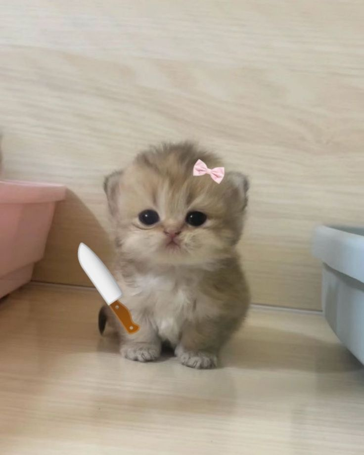
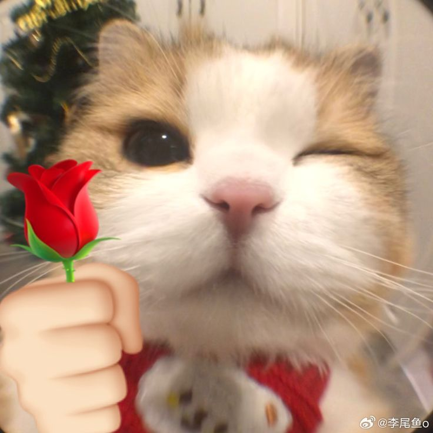
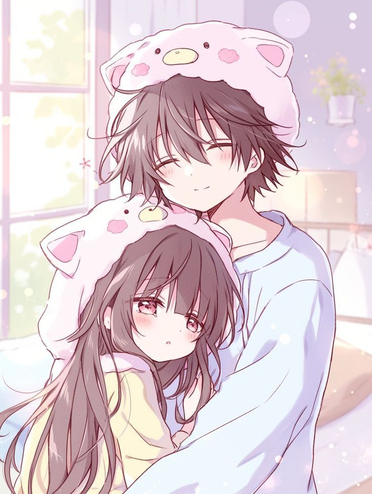
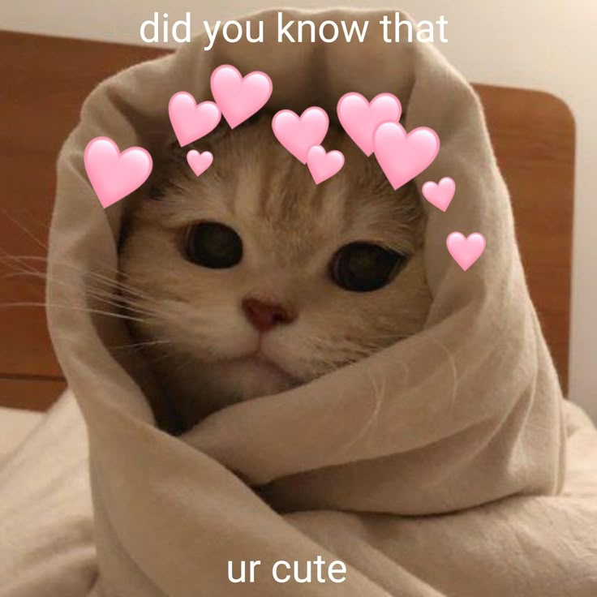
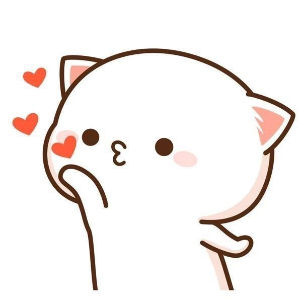

<!DOCTYPE html>
<html lang="en">
<head>
  <meta charset="UTF-8" />
  <meta name="viewport" content="width=device-width, initial-scale=1.0" />
  <title>For My Cutest Girl 💕</title>

  <!-- Cute Google Font -->
  <link href="https://fonts.googleapis.com/css2?family=Pacifico&family=Quicksand:wght@400;600&display=swap" rel="stylesheet">

  
</head>
<body>

<!-- QUESTION -->

  <h1>Hiiii my babyyyy 🥺💗</h1>
  
Before we start… answer this honestly okayyy? 😳💕

  <h1>Do you love me? 💕</h1>
  <button onclick="show('boxes')">Yesss foreverrr 😘</button>
  <button onclick="show('no')">Nope 😒</button>

<!-- NO -->

  <h1>HOW DARE YOUUU 😤💔</h1>
  
That was the wrong answer missy 😠

  
   
  <button onclick="show('q')">Try again properly 👉🥺</button>

<!-- BOXES -->

  <h1>YAYYYY 🥰💝</h1>
  
Choose a cute lil box baby 💕

  
  

    
🎁 Compliment Box

    
🤗 Hug Box

    
💌 Love Box

    
🎮 Fun Box

  

<!-- BOX 1 -->

  <h1>HEY YOUUU 😳💖</h1>
  
You are the mostesttttt beautiful girl in the whole entire universe ✨💗
     I still don’t understand how you’re THIS pretty 🥺

  
   <button class="back" onclick="show('boxes')">⬅ Go back cutie</button>

<!-- BOX 2 -->

  <h1>I MISS YOUUU SOOO MUCH 😭💞</h1>
  
Hyyyyy my loveee, I’m missingg youu sooo sooo much 🫂
     Please accept this warm virtual hug 💕

  
   <button class="back" onclick="show('boxes')">⬅ Backkk</button>

<!-- BOX 3 -->

  <h1>BEST GIRLFRIEND EVER 🥹💘</h1>
  
You are the best girlfriend in the worldddddd 😤💗
     I’m so lucky to have you it’s unreal 😌

  
   <button class="back" onclick="show('boxes')">⬅ Back baby</button>

<!-- BOX 4 GAME -->

  <h1>OKAY CUTIE 😼🎮</h1>
  
Beat me in Tic Tac Toe and steal my heart completely 😏💞

  

  

  <button class="back" onclick="show('boxes')">⬅ Choose again</button>

<!-- FINAL -->

  <h1>WAIFU MATERIAL 💍💖</h1>
  
  

    You are beautiful in ways words don’t even know how to explain 🥺✨
    Your smile melts my heart, your laugh makes my day brighter,
    and your love makes my world feel complete 💕
    You are my favorite person, my safe place,
    and my forever kind of girl 💗
  

</body>
</html>
